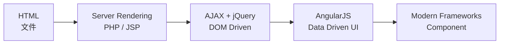
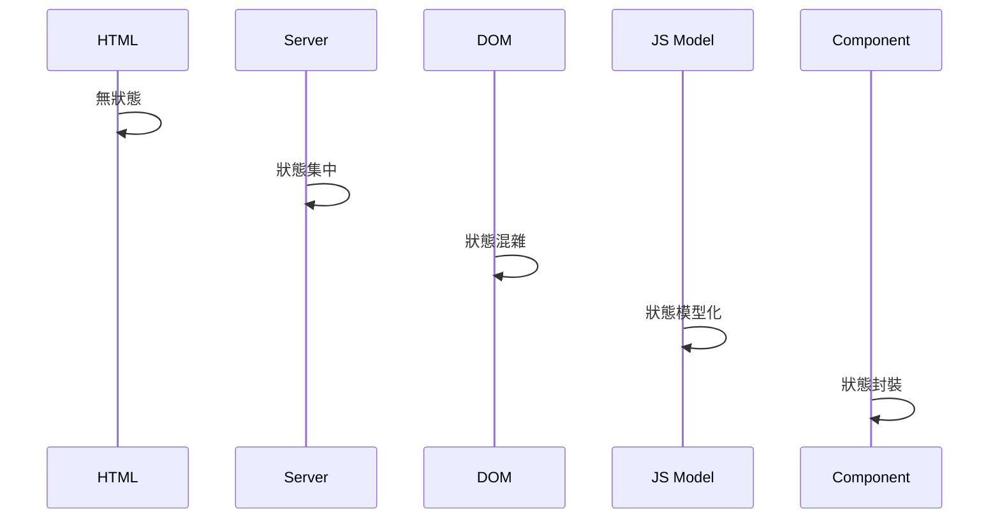

# Web Architecture Evolution
> 前後端架構演進的學習筆記（Frontend 篇）

本 Repo 用來整理 Web 前端在不同時代**如何解決同一個問題**，
並觀察「狀態（State）」與「責任」如何隨時間轉移。

核心方法：
> **用「同一個功能」在不同時代重寫一次**

---

## 範例功能（全篇共用）

**Todo List**
- 顯示清單
- 新增一筆資料

---

## Frontend 演進總覽

---

## 狀態責任轉移

---

## 章節導覽

- frontend/00-overview.md
- frontend/01-static-html.md
- frontend/02-ssr.md
- frontend/03-ajax-jquery.md
- frontend/04-angularjs.md
- frontend/05-modern-frameworks.md