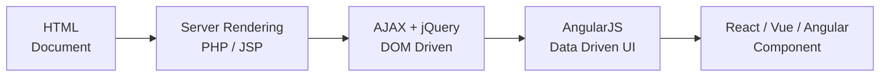
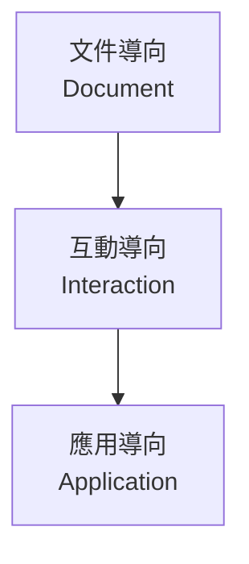
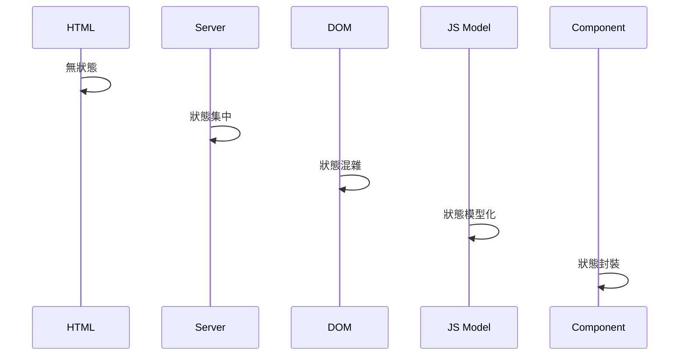

# Web Architecture Evolution
> 前後端架構演進的學習筆記（Frontend 篇）

本 Repo 用來整理 Web 架構的**演進邏輯與因果關係**，  
重點不是框架語法，而是：

> **狀態（State）與責任如何在系統中轉移**

---

## Frontend 演進總覽



---

## Web 的本質轉變



---

## 狀態（State）責任轉移



---

## Repo 結構

```text
web-architecture-evolution/
│
├─ README.md
│
├─ frontend/
│   ├─ 00-overview.md
│   ├─ 01-static-html.md
│   ├─ 02-ssr.md
│   ├─ 03-ajax-jquery.md
│   ├─ 04-angularjs.md
│   └─ 05-modern-frameworks.md
│
└─ backend/   #（預計擴充）
```

---

## 為什麼要整理這些？

- 建立「技術為何出現」的因果關係
- 幫助未來做架構選型
- 作為長期可回顧的工程筆記

---

## 延伸閱讀

- frontend/00-overview.md
- frontend/01-static-html.md
- frontend/02-ssr.md
- frontend/03-ajax-jquery.md
- frontend/04-angularjs.md
- frontend/05-modern-frameworks.md
