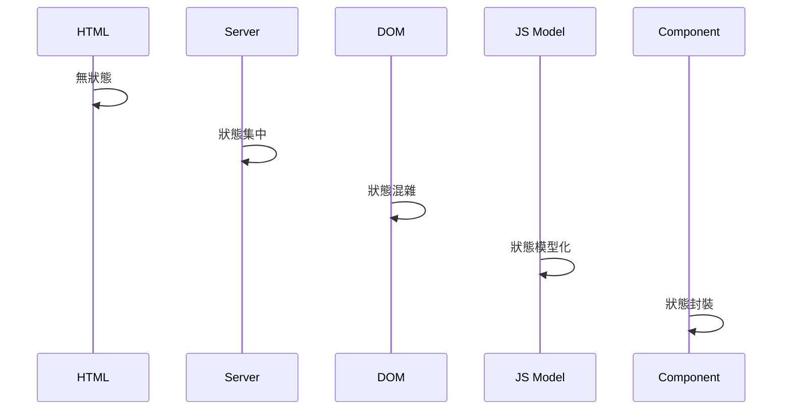

# Frontend 演進總覽（Overview）

> Web 前端的歷史，是「狀態從無 → Server → DOM → JS → Component」的過程。

```mermaid
sequenceDiagram
    participant HTML as HTML
    participant Server as Server
    participant DOM as DOM
    participant JS as JS Model
    participant Comp as Component

    HTML->>HTML: 無狀態
    Server->>Server: 狀態集中
    DOM->>DOM: 狀態混雜
    JS->>JS: 狀態模型化
    Comp->>Comp: 狀態封裝
```