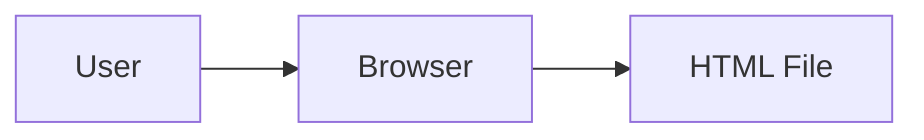

# 01 · 純靜態 HTML（文件時代）

## 架構


```mermaid
flowchart LR
    User --> Browser --> HTML["HTML File"]
```

## Todo 範例

```html
<ul>
  <li>Buy milk</li>
  <li>Write report</li>
</ul>
```

## 特性
- 無狀態
- 無互動
- 僅能顯示結果