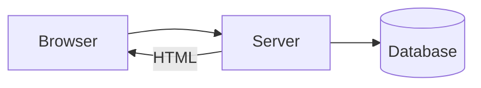

# 02 · Server-Side Rendering（PHP / JSP）

## 架構



## Todo 範例（PHP）

```php
<ul>
<?php foreach ($todos as $todo): ?>
  <li><?= $todo ?></li>
<?php endforeach; ?>
</ul>

<form method="post">
  <input name="todo">
  <button>Add</button>
</form>
```

## 特性
- 狀態在 Server
- 每次操作整頁刷新