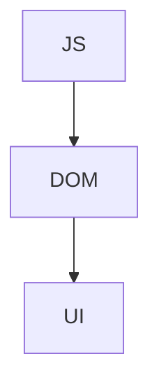

# 03 · AJAX + jQuery（DOM 導向）

## 架構



## Todo 範例

```html
<input id="todo">
<button id="add">Add</button>
<ul id="list"></ul>
```

```js
var todos = [];

$("#add").click(function () {
  todos.push($("#todo").val());
  $("#list").append("<li>" + $("#todo").val() + "</li>");
});
```

## 問題
- DOM 成為狀態來源
- JS 與 UI 強耦合