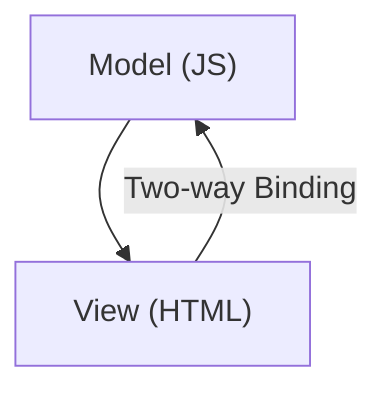

# 04 · AngularJS（資料導向 UI）

## 架構



## Todo 範例

```html
<input ng-model="newTodo">
<button ng-click="add()">Add</button>

<ul>
  <li ng-repeat="t in todos">{{ t }}</li>
</ul>
```

```js
$scope.todos = [];

$scope.add = function () {
  $scope.todos.push($scope.newTodo);
};
```

## 重點
- 只操作資料
- 畫面自動更新