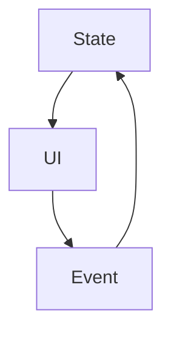

# 05 · 現代前端框架（Component 時代）

## 架構



## Todo 範例（React 思維）

```js
function TodoApp() {
  const [todos, setTodos] = useState([]);

  return (
    <>
      <input onKeyDown={e =>
        e.key === "Enter" &&
        setTodos([...todos, e.target.value])
      } />
      <ul>
        {todos.map(t => <li key={t}>{t}</li>)}
      </ul>
    </>
  );
}
```

## 特性
- Component 封裝狀態
- 單向資料流