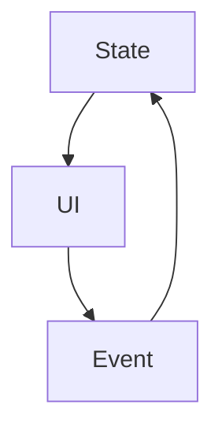
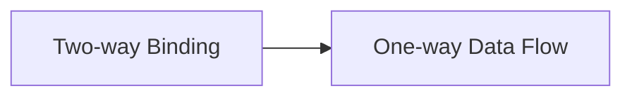

# 現代前端框架（Component 時代）

```mermaid
flowchart TB
    State --> UI --> Event --> State
```

```mermaid
flowchart LR
    AngularJS["Two-way Binding"] --> Modern["One-way Data Flow"]
```

- Component-based
- 單向資料流
